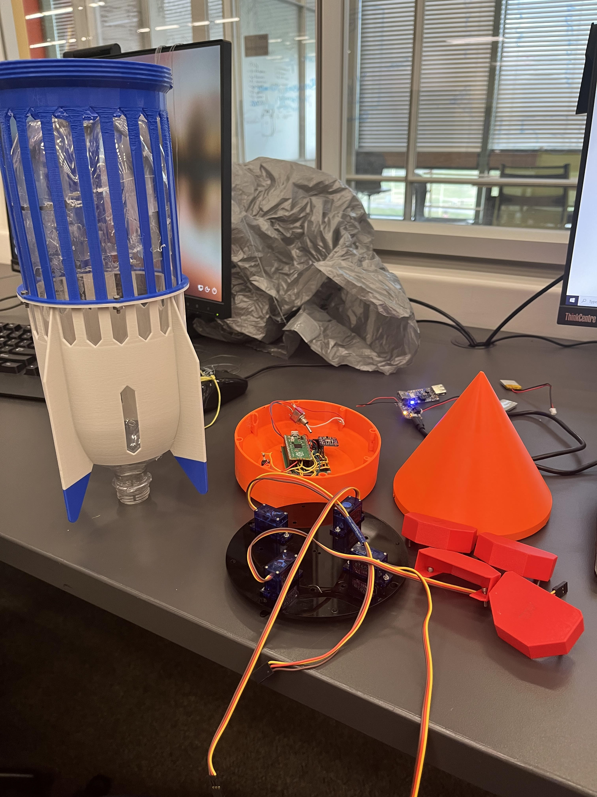

# Pi in the sky project
By Nathaniel and Thomas

**Project Goal: Launch a Raspberry Pi into the air and have it record data then land safely**

## Project Planning

### Project Outline
  To make a mortar that launches water rockects out of it by throwing one in and it getting punctured through the cap by a nail at the bottom of the mortar to then launch the rocket.
  
### Materials
  + Cvc Pipe
  + Sharp Nail
  + 2L Soda Bottle
  + Nose Cone(3d Printed)
  + Fins(3d Printed)
  + Parachute
  + Casing for Electronice(3d Printed/Lasercut)
  + Electronics
    + Raspberry Pi
    + Altimeter
    + Battery 
    + Circuit Board
    
### Function
  The mechanism for how the mortar is very simple. You throw a pressurized water rocket into the mortar and when it hits the bottom, there is a nail that punctures the cap of the water rocket, releasing the pressure and propelling the rocket upwards. The mortar itself will be a simple cvc pipe that is set at an angle on a stand to send the water rocket in an ark, like a mortar.
  
### What we need to learn
  We need to figure out the ideal size of the cvc pipe to optimize the launch, as well as figure how to design the rocket itself. Specifically we need to design an area to safely hold the raspberry pi and whether we would need a parachute or not. Also, we need to figure out how water pressure works and what the best way to optimize it is for our purposes.
  
### What is success?
  Have a functionioning Mortar that can effectively launch multiple water rockets at a time without flaw and having one of the rockets measure the height it reaches and possibly measure it's arc and the distance it travels as well. Also, try to make the rockets go as high and as far as we can.
  
### Saftey concerns/Risk Mitigation
  The risks of the water rocket is the highly pressurized water that could hurt someone or certainly get someone wet. To mitigate these risks we will make sure everone is using proper PPE and make sure everyone is far enough away at launch. Another risk is the nail in the bottom of the mortar which will be very sharp, we will mitigate this risk by handiling the nail safely and as little as possible. The only other risk is the flight path of the rocket, we will mitigate this risk by making sure everyone is out of the way in the way the mortar is pointing as to not hit anyone.
  
### Iterations 

+ #### Debates about the protection of the components
   + No parachute or substantial protection. Cons: All components would break constant replacement and Mr. Miller angry. Pros: Very light and Easy
   + Substantial protection through securing electronics to wall of the cone. Cons: Components would probably still break, Mr Miller probably angry. Pros: Very light, might provide some protection
   + Peanut Butter protection. Cons: Messy, Ruins the electornics, 3d printed stuff would still break. Pros: Peanut Butter, Electronics wouldn't break?
   + **Parachute. Cons: Heavier, hard to design, might not work. Pros: Should protect electronics and all components.**
+ #### Launching Mechanism
   + Rocket launcher. Cons: Lame, boring, unoriginal. Pros: It would go very high, Very easy to make/use, safe.
   + **Mortar. Cons: Rocket can't get as high, slightly unsafe. Pros: Awesome, goes in a measurable? arc, can launch multiple rockets/shells**
   + Truck Rockets. Cons: Nothing at all, "unsafe". Pros: Awesome, moveable, on a golf cart.
 
### Schedule

T < December 5, Planning and document

December 5 < T < December 25, Onshape design

December 25 < T < January 25, Coding

January 25 < T < March 1, Testing and refineing rocket 

March 1 < T < April 1, Installation and testing of electronics and tracking device, and parachute.

April 1 < T < Spring break, Final testing and tweaking

#ONSHAPE

Base- To make the base we stole Wills picture of a bottle and traced it with a spline. We then revolved it and cut weight reduceing gaps in the base. We also cut the base in half so thatis can be bolted together with a flange.

Threads- The threads at the top of the base were homemade from scratch. We drew a helix and then revolved a triangle around the helix. The other piece was then boleaned from the new threads to make the finished product. The result was buttery smooth threads with no thread tool needed. Nice!

Warhead- The warhead took a few trials and tribulations to get right. We started with a dome that had a inner cylinder to shield the parachute from the servos. We then decided to go to a cone shape with an inner cone, then just a cone with servo covers that shield the servos. This left us with more space for the parachute and easier deployment.

Goodies compartment- The goodies compasrtment is where the majic happens, that holds all the electronicans and keeps them safe.

### Diagrams

#### Rocket Diagram

#### Mortar Diagram

#### Block Diagram

## Project Timeline

### Week 1(Dec. 5th - Dec. 9th)

#### Goals

Start designing the rocket and mortar in onshape and get a good idea of what the project is going to look like.

#### Progress

+ Rough Mortar design in onshape

+ Brainstorming - Figuring out exact ideas for the shell of the bottle rocket, mortar will be set at 45 degree angle to maximize distance.

### Week 2(Dec. 12th - Dec. 16th)

#### Goals

Continue work on rocket shell and refine ideas for assembley and specifics of the mechanisms of the rocket and what it'll be able to do

#### Progress 

+ Intial design of rocket mostly complete, created the casing that will go around the actual bottle. Still need to design the area to hold the electronics and parachute

+ Concept for launch sequence mostly formulated and designed, pvc cap will have a hole drilled through it to hold the nail which will pierce the bottle and launch it. There will also be holes to drain excess water from the bottom of the mortar through the cap

+ Design for mortar holder completed 

+ Brainstorming - Best way to integrate a parachute while also fufilling perameters of the project is to have servos in the top of the rocket casing to spin, releasing the cap of the rocket casing, allowing the parachute to deploy. These servos will activate the parachute at a set height which will be calculated using an altimeter in the rocket.

### Week 3(Jan. 3rd - Jan. 6th)

#### Goals

Finish the onshape design for the project and make sure the rocket casing will be able to hold all electronics that are needed and fully be able to fufill our project goals

#### Progress

+ Completion of the onshape design for the rocket casing

+ Completion of holders for electornics inside casing(Circuit board, Servos)

#### Servo Design

#### Circuit Board Design

### Week 4(Jan. 9th - Jan. 13th)

#### Goals

Starting the coding process and formulating how the parchute will deploy

#### Progress

+ Starting the code for the parachute trigger when the rocket reaches a certain altitude and for the button to reattach the nose cone

+ [Code for the parachute](https://github.com/nmckee78/Piintheskyrocket/blob/main/servo_code).

+ Brainstorming Ideas - What angle do the servos need to be to properly release? - Answer: 180, How to make sure the parachute won't get stuck on the servos? - Answer: Some sort of protective layer or sheet between the two, not fully figured out, Will the servos have enough power to hold the cone on all by themselves - Answer: Need to test to find out

### Week 5(Jan. 17th - Jan. 20th)

#### Goals

Create code for data collection 

#### Progress 

+ Started coding for the data collection, got pretty stuck.

+ [Assembled Code](https://github.com/nmckee78/Piintheskyrocket/blob/main/servo_code).

### Week 6(Jan. 23rd - Jan. 27th)

#### Goals

Continue to work on code, brainstorm ideas to improve the rocket.

#### Progress

+ Continued to try to work out the code, continued to be stuck

+ Brainstormed ideas to improve the rocket(Incl. Smaller nose cone, Weight reducing in bottom of rocket, better threads.

+ 3d printed first part of the rocket, went well

### Week 7(Jan. 30th - Feb. 3rd)

#### Goals

Keep working on code, implement rocket ideas

#### Progress 

+ Started to figure out the code but still not implementing it

+ Discussed more ways to reduce weight and increase efficency in the rocket 

+ Added more slits in bottom of rocket, 3d printed test threads(Did not work)

+ Made new threads 

### Week 8(Feb. 6th - Feb. 10th)

#### Goals

Actually finish the code, get more pieces of the rocket, continue to refine rocket design

#### Progress

+ Finished the code! 

+ [Final code](https://github.com/nmckee78/Piintheskyrocket/blob/main/servo_code).

+ Printed middle part of rocket, might need to redesign, kinda flimsy

+ Printed working threads 

+ Continued to improve cad design

+ Started to think about parachute implemenation

### Week 9(Feb 13- Feb 17th)

#### Goals

+ Make the parachute

+ Continue to Improve Cad

+ Start the circuit Board

#### Progress
+ This week I made the parachute. I did this by cutting out a 50 cm radius circle from trash bag. I then put duck tape patchs around the edge for reinforcement, and punched holes for strings. I tied strings to the holes than tied all of those to a main cord and the parachute was done.

+ Continued to Redesign cad, added seperate spring holes and made the cone pointier and better

+ Started to brainstorm the Circuit Board

### Week 10(Feb 20- Feb 24th)

#### Goals
+ Test the Parachute

+ Print final cad design

+ Start Circuit Board

#### Progress

+ We threw the parachute off the hill tied to a 2x4 and it succesfully deployed. At first it was not opening in time and we discoverd that to make it open fast enough we had too shorted the main cord and not fold it as many times. After this innnovation we succeded in making it work consistanly.

+ Printed The rest of the Cad, it all worked well and as intended.

+ Started work on the circuit board, sodered in headers for the Pico and started work on the servos

### Week 11(Feb 27th- Mar 3rd)

#### Goals
+ Assemble Cad

+ Start Circuit Board Assembely

#### Progress
+ Final cad design works, everything fits well and the new threads work

+ Started circuit board sodering, headers are in and work on pins for the servos has started

### Week 12(Mar 6th- Mar 10th)

#### Goals
+ Continue work on circuit board

+ Start testing cad with code

#### Progress
+ Servo headers sodered, circuit board nearing completion. 

+ Tested code(on the computer) and it works well with the cad. 

### Week 13(Mar 13th- Mar 17th)

#### Goals
+ Finish Circuit Board

+ Start testing circuit board with the cad

#### Progress
+ Completed the circuit board

+ Sodered button onto cad & circuit board to release the servos

+ Tested the circuit board, it functions but servos weren't working

### Week 14(Mar 20th- Mar 24th)

#### Goals
+ Problem solve with servo issue 

+ Make sure circuit board functions the way we want it to

#### Progress
+ Troubleshoooted the servos, didn't make much progress

+ Tried to get data collection working

### Week 15(Mar 27th- Mar 31st)

#### Goals
+ Fix the servos 

+ Soder a switch for data mode/code mode switching

#### Progress
+ Managed to get the servos working(Had to rearange the wiring for the power on the circuitboard)

+ Sodered the switch on

+ Started to prepare for launch

### Week 16(Apr 10th- Apr 14th)

#### Goals
+ Launch the rocket

+ Troubleshoot if things go wrong

### Launch 1

 

The first launch very nearly worked. Everything went correctly, the cone latched on, the servos were working and the rocket went in a perfect parabolic arc. However, even though the servos unlatched, the cone never fully popped off, meaning the parachute never deployed and after perfectly flying through the air it crashed into the ground and shatterd. Luckily, the circuit board and all the electronics were protected but nearly all the rest of the rocket was destroyed. We didn't have the code working to collect data properly so no data for this launch.

### Progress

+ Started to brainstorm what we did wrong

+ Reprinted the broken parts

### Week 17(Apr 17th- Apr 21th)

#### Goals

+ Brainstorm ways to get rocket to land safely

+ Succesfully launch the rocket

### Launch 2

 

The second launch incorporated a system utilizeing rubber bands to yoink the cone off the nose of the rocket. We did not use enough rubber bands to succesfully extridite the cone from its post. The rocket went up in the air, and like launch 1, it ended in disaster. The cone, the cage, the mounting plate, the covers, the fins, all KIA. Also like the first launch, the goodies compartment and all the splendor hidden within, survived the the hit to live another day. Also like the first launch, it didnt record data for some reason. 

#### Progress

+ Brainstrom a new way to deploy the parachute

+ Print new parts to replace the old ones

+ Get the code to actually collect data

### Week 18(Apr 24th- Apr 28th)

#### Goals

+ Get a new way to deploy the parachute

+ Test the code to make sure it actaully collects data

+ Have all the parts ready to launch

#### Progress

+ Got the code to actaully collect data

+ Decided to ditch a cone and have the parachute open to the elements with a single rubber band holding it down, which releases when the servo spins when it starts going down

### Week 19(May 1st- May 5th)

#### Goals

+ Launch the new rocket design

+ Get recorded data

### Launch 3

Before this launch, the launcher that we had been using broke meaning we had to use the other one which didn't properly read pressure. This meant we didn't know how much pressure so we launched it with not enough pressure so it went about 10 feet in the air before it came crashing back down, which was not enough time for the parachute to deploy. However, it did record data. This data made us realize that the altimeter wasn't taking data fast enough so the servos would never spin in time.(We don't have a video for this one)

#### Progress

+ Made the altimeter take data a lot faster, meaning the parachute should actaully be able to deploy

+ Reprinted the parts to get ready for a launch next week.

### Week 20 (May 8th - May 12th)

### Goals
+ Succesful launch and nice data

### Launch 4 - Success!

 

This launch we used the faulty launcher again, but were knew how much pressure we needed due to extensive testing beforehand. The launch actaully got far enough into the air this time but again looked like a fail as it came crashing back down to earth, however with maybe 1 second before impact, the parachute deployed and flipped the rocket, saving it from its impending death as it landed softly on the ground. 

### Progress
+ We were only both here friday due to AP testing all week

### Week 21 (May 15th - 19th)

### Goals
+ Smoother launch

### Launch 5 - Perfection 

 

We again used the faulty launcher but used a bit more pressure this time for better results. We launched this twice, with both launches being succesful, but the second being very nearly perfect. We launched it off the hill into the baseball field to give it more time of flight which made the launch cooler.

### Progress
+ Started documentation after finishing our launch

